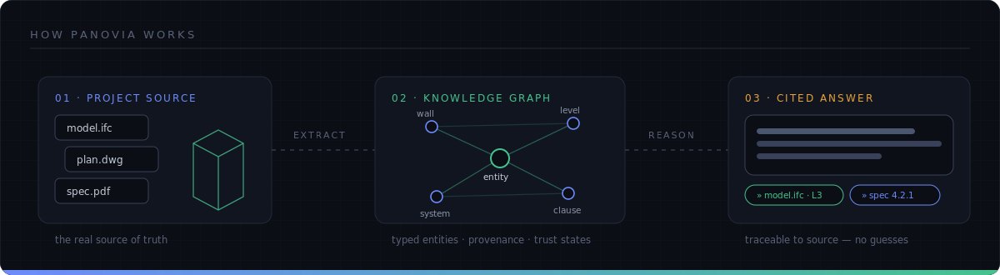

<!-- ════════════════════════════════════════════════════════════════════
      Syed Osama Ali · GitHub Profile README · v2
      Design system → drawing-sheet aesthetic (AEC)
      Palette → indigo #6E8BFA · green #46C28E · amber #E8A33D · ink #0B0E14
      All custom visuals live in ./assets (animated SVG, no external deps)
     ════════════════════════════════════════════════════════════════════ -->

<!-- ░░░ HERO — custom animated SVG ░░░ -->

  

<!-- ░░░ IDENTITY BADGES ░░░ -->

  
  
  

  
  
  

 

<!-- ════ A-01 · BUILDING PANOVIA ════ -->

 

> **Panovia** is an AI-native knowledge layer for **AEC** — Architecture, Engineering & Construction. An agentic assistant that understands a project's real source of truth and answers with **evidence**, not guesses.

 

As **CTO at [Attimo Technologies](https://www.linkedin.com/in/syed-osama-ali-shah-a74a23215)** — UK-incorporated, engineering out of Ankara — I own the technical direction and the build:

|  | What that means in practice |
|:--|:--|
| 🧠 **Reads the model** | Understands projects from their **actual models and drawings** — not a chatbot bolted onto PDFs |
| 🔍 **Evidence-first** | Every answer is **traceable back to the source**, so engineers trust it on work that matters |
| 🏗️ **Built for AEC** | Purpose-built for the way real project teams actually operate |
| 🎓 **Backed** | **UCL Hatchery** at BaseKX, King's Cross |

  

 

<!-- ════ A-02 · TECH I WORK WITH ════ -->

 

**Core Stack**

**AI · Computer Vision · Knowledge**

 

 

<!-- ════ A-03 · GITHUB ACTIVITY ════ -->

 

  

  

 

<!-- ════ A-04 · WRITING ════ -->

 

- 📖 [**Enhancing AI Model Accuracy With RAG**](http://www.osamaali.tech/2024/07/ragforaccuracy.html) — a deep dive into Retrieval-Augmented Generation.

More at **[osamaali.tech](http://www.osamaali.tech/)**.

 

<!-- ════ A-05 · CONNECT ════ -->

 

  

<!-- ░░░ FOOTER — custom animated SVG ░░░ -->

